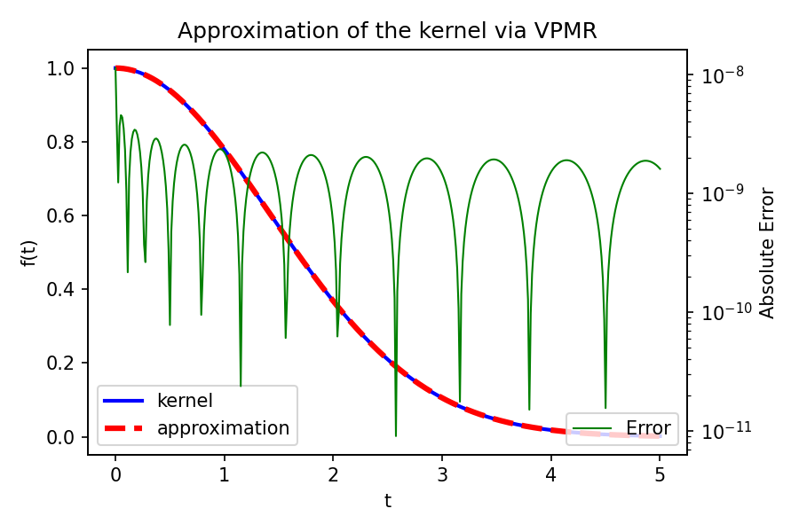
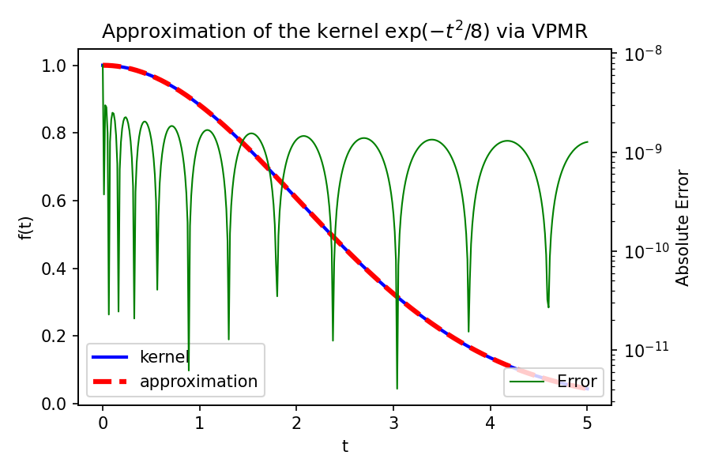

# VPMR C++ Implementation

[](https://doi.org/10.5281/zenodo.7770194)

[](https://www.gnu.org/licenses/gpl-3.0.en.html)

## What Is This?

This is a C++ implementation of the VPMR algorithm to compute the approximation of arbitrary smooth kernel.

Check the reference paper [10.1007/s10915-022-01999-1](https://doi.org/10.1007/s10915-022-01999-1) and
the [original](https://github.com/ZXGao97/VPMR) MATLAB implementation for more details.

## Dependency

1. [gmp](https://gmplib.org/) for multiple precision arithmetic
2. [mpfr](https://www.mpfr.org/) for multiple-precision floating-point computations
3. [mpreal](http://www.holoborodko.com/pavel/mpfr/) `mpreal` type C++ wrapper, included
4. [BigInt](https://github.com/faheel/BigInt) `BigInt` arbitrary large integer for combinatorial number, included
5. [Eigen](https://eigen.tuxfamily.org/) for matrix decomposition, included
6. [tbb](https://github.com/oneapi-src/oneTBB) for parallel computing
7. [exprtk](https://github.com/ArashPartow/exprtk.git) for expression parsing, included
8. [exprtk-custom-types](https://github.com/ArashPartow/exprtk-custom-types.git) for `mpreal` support, included

## How To

### Compile

> **Warning**
> The application relies on `eigen` and `exprtk`, which are very heavy usage of templates.
> The compilation would take minutes and around 1 GB memory.

The following is based on Fedora. For Windows users, please use WSL.
Native support is hard as porting dependencies to Windows is cumbersome.

1. Install compiler, `cmake` and `git`.
   ```bash
   sudo dnf install gcc g++ gfortran cmake git -y
   ```
2. Install `tbb`, `gmp` and `mpfr` packages.
   ```bash
   sudo dnf install tbb-devel mpfr-devel gmp-devel -y
   ```
3. Initialise submodules.
   ```bash
   git submodule update --init --recursive
   ```
4. Configure and compile.
   ```bash
   cmake -DCMAKE_BUILD_TYPE=Release .
   make
   ```

### Use

#### Provide Kernel

It is necessary to provide kernel function in a text file.
The file should contain the kernel function expressed as a function of variable `t`.

The `exprtk` is used to parse the expression and compute the value.
The provided kernel function must be valid and supported by `exprtk`.

For example, to compute the approximation of `exp(-t^2/8)`, one can create a file `kernel.txt` with the following
content:

```text
exp(-t*t/8)
```

#### Usage

All available options are:

```text
Usage: vpmr [options]

Options:

   -nc <int>    number of exponent (default: 4)
   -n <int>     number of terms (default: 10)
   -d <int>     number of digits (default: 512)
   -q <int>     quadrature order (default: 500)
   -e <float>   tolerance (default: 1E-8)
   -k <string>  file name of kernel function (default: exp(-t^2/4))
   -h           print this help message
```

#### Example

The default kernel is `exp(-t^2/4)`. One can run the application with the following command:

```bash
./vpmr -n 30
```

The output is:

```text
Using the following parameters:
        nc = 4.
         n = 30.
     order = 500.
 precision = 512.
 tolerance = 1.0000e-08.
    kernel = exp(-t*t/4).

M = 
+1.0589202279681926e-11+0.0000000000000000e+00j
-5.4905134221689715e-03+2.2104939243740062e-03j
-5.4905134221689715e-03-2.2104939243740062e-03j
+1.1745193571738943e+01-5.7707212536725188e-153j
-5.5143304351134397e+00-5.7204056791636839e+00j
-5.5143304351134397e+00+5.7204056791636839e+00j
-1.6161617424833762e-02+2.3459542440459513e+00j
-1.6161617424833762e-02-2.3459542440459513e+00j
+1.6338578576177487e-01-1.9308431539218418e-01j
+1.6338578576177487e-01+1.9308431539218418e-01j
S = 
+0.0000000000000000e+00+0.0000000000000000e+00j
+1.7655956664692953e+00-2.7555720406099038e+00j
+1.7655956664692953e+00+2.7555720406099038e+00j
+1.8757961592204051e+00-0.0000000000000000e+00j
+1.8700580506914817e+00-6.2013413918954552e-01j
+1.8700580506914817e+00+6.2013413918954552e-01j
+1.8521958553280000e+00-1.2601975249082220e+00j
+1.8521958553280000e+00+1.2601975249082220e+00j
+1.8197653300065935e+00-1.9494562062795735e+00j
+1.8197653300065935e+00+1.9494562062795735e+00j

Running time: 7 s.
```

#### Visualisation

The `plotter` folder contains a Python script to plot the result.

It is necessary to have `matplotlib` and `numpy` available in, for example, the virtual environment.

Copy and paste the `M` and `S` values to `weights` variable in `plotter/plotter.py` and run the script to plot the
result.

For the above example, the result is:



#### Arbitrary Kernel

```bash
echo "exp(-t*t/8)" > kernel.txt
 ./vpmr -n 60 -k kernel.txt -nc 6
```



## Binary

The binary released requires available `gmp`, `mpfr` and `tbb` libraries.

```bash
vpmr/cmake-build-release on  master [!] via △ v3.26.0 
❯ ldd vpmr 
        linux-vdso.so.1 (0x00007ffcf3121000)
        libgmp.so.10 => /lib64/libgmp.so.10 (0x00007f72087e8000)
        libmpfr.so.6 => /lib64/libmpfr.so.6 (0x00007f7208736000)
        libtbb.so.2 => /lib64/libtbb.so.2 (0x00007f72086f2000)
        libstdc++.so.6 => /lib64/libstdc++.so.6 (0x00007f7208400000)
        libm.so.6 => /lib64/libm.so.6 (0x00007f7208320000)
        libgcc_s.so.1 => /lib64/libgcc_s.so.1 (0x00007f72086d0000)
        libc.so.6 => /lib64/libc.so.6 (0x00007f7208143000)
        /lib64/ld-linux-x86-64.so.2 (0x00007f72088a1000)
```
