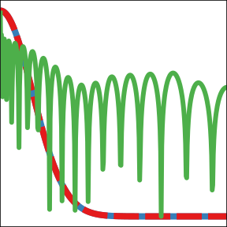
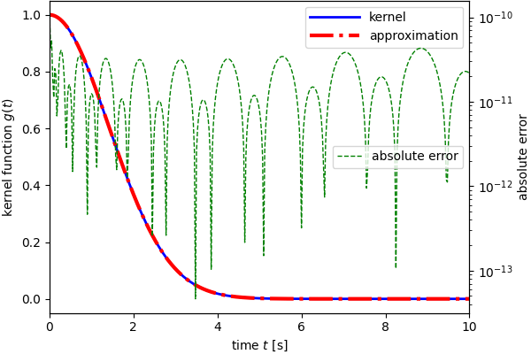
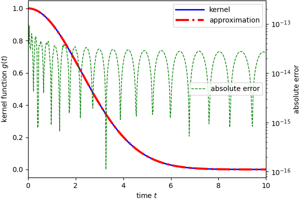
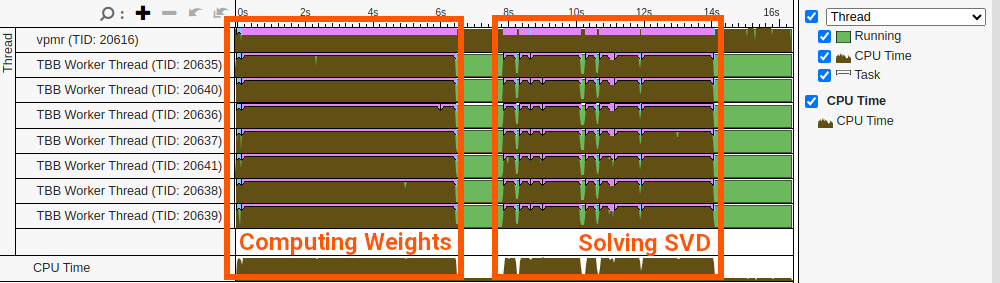

# VPMR C++ Implementation



[](https://doi.org/10.5281/zenodo.7770193)
[](https://codecov.io/gh/TLCFEM/vpmr)
[](https://pypi.org/project/pyvpmr/)
[](https://hub.docker.com/r/tlcfem/vpmr/tags)

[](https://www.gnu.org/licenses/gpl-3.0.en.html)

## Call For Help

- [ ] **more performant parallel SVD algorithm**: `eigen` only provides sequential SVD
- [ ] **alternative integration**: currently only Gauss-Legendre quadrature is available

## What Is This?

This is a C++ implementation of the VPMR algorithm to compute the approximation of arbitrary smooth kernel.
A Python package is also provided.

Check the reference paper [10.1007/s10915-022-01999-1](https://doi.org/10.1007/s10915-022-01999-1) and
the [original](https://github.com/ZXGao97/VPMR) MATLAB implementation for more details.

In short, the algorithm tries to find a summation of exponentials to approximate a given kernel function.
In mathematical terms, it looks for a set of $m_j$ and $s_j$ such that

$$
\max_{t\in{}I}\left\|g(t)-\sum_jm_j\exp(-s_jt)\right\|<\epsilon.
$$

In the above, $g(t)$ is the given kernel function and $\epsilon$ is the prescribed tolerance.

## Dependency

The following libraries are required:

1. [gmp](https://gmplib.org/) for multiple precision arithmetic
2. [mpfr](https://www.mpfr.org/) for multiple-precision floating-point computations
3. [tbb](https://github.com/oneapi-src/oneTBB) for parallel computing

The following libraries are included:

1. [mpreal](http://www.holoborodko.com/pavel/mpfr/) `mpreal` type C++ wrapper, included
2. [Eigen](https://eigen.tuxfamily.org/) for matrix decomposition, included
3. [exprtk](https://github.com/ArashPartow/exprtk.git) for expression parsing, included
4. [exprtk-custom-types](https://github.com/ArashPartow/exprtk-custom-types.git) for `mpreal` support, included

## How To

If the application needs to be compiled on your machine (build the binary from source, python wheels are not available, etc.), you need to install the compiler and three libraries.

1. On RPM-based Linux distributions (using `dnf`), you need to `sudo dnf install -y gcc-c++ tbb-devel mpfr-devel gmp-devel`.
2. On DEB-based Linux distributions (using `apt`), you need to `sudo apt install -y g++ libtbb-dev libmpfr-dev libgmp-dev`.
3. On macOS, you need to `brew install gcc tbb mpfr gmp`.

If the binary is available (run the pre-compiled binary, python wheels are available, etc.), you only need the runtimes of three libraries.
You can find the exact names on [pkgs.org](https://pkgs.org/) by searching `tbb`, `gmp` and `mpfr`.

> [!WARNING]
> Windows users need to have a working [MSYS2](https://www.msys2.org/) environment. See below for more details.
> For other environments, you need to figure out how to install `gmp` and `mpfr` on your own.

### Docker

You can simply pull the image using the following command.

```bash
docker pull tlcfem/vpmr
# or using GitHub Container Registry
docker pull ghcr.io/tlcfem/vmpr
```

Just use it as you would normally do with any other docker images.
For example,

```bash
docker run tlcfem/vpmr -n 30
```

To build the image locally, use the provided `Dockerfile`.

```bash
wget -q https://raw.githubusercontent.com/TLCFEM/vpmr/master/resource/Dockerfile
docker build -t vpmr -f Dockerfile .
```

### Python Package

> [!WARNING]
> The Python module needs external libraries to be installed.
> See above.

On most platforms (Linux and macOS), wheels are available, simply install the package with `pip`.

```bash
pip install pyvpmr
```

If the corresponding wheel is not available, the package will be compiled, which takes a few minutes.
The execution of the algorithm always requires available `gmp`, `mpfr` and `tbb` libraries.

#### Jumpstart

```python
import numpy as np

from pyvpmr import vpmr, plot


def kernel(x):
    return np.exp(-x ** 2 / 4)


if __name__ == '__main__':
    m, s = vpmr(n=50, k='exp(-t^2/4)')
    plot(m, s, kernel)
```

### Standalone Binary

All available options are:

```text
Usage: vpmr [options]

Options:

    -n, --max-terms             <int>     number of terms (default: 10)
    -c, --max-exponent          <int>     maximum exponent (default: 4)
    -d, --precision-bits        <int>     number of precision bits (default: 512)
    -q, --quadrature-order      <int>     quadrature order (default: 500)
    -m, --precision-multiplier  <float>   precision multiplier (default: 1.05)
    -e, --tolerance             <float>   tolerance (default: 1E-8)
    -k, --kernel                <string>  file name of kernel function (default uses: exp(-t^2/4))
    -s, --singular-values                 print singular values
    -w, --weights                         print weights
    -h, --help                            print this help message
```

The minimum required precision can be estimated by the parameter $n$.
The algorithm involves the computation of $C(4n,k)$ and $2^{4n}$.
The number of precision bits shall be at least $4n+\log_2C(4n,2n)$.
In the implementation, this number will be further multiplied by the parameter $m$.

#### Example

The default kernel is `exp(-t^2/4)`. One can run the application with the following command:

```bash
./vpmr -n 30
```

The output is:

```text
Using the following parameters:
       terms = 30.
    exponent = 4.
   precision = 355.
 quad. order = 500.
  multiplier = 1.0500e+00.
   tolerance = 1.0000e-08.
      kernel = exp(-t*t/4).

[1/6] Computing weights... [60/60]
[2/6] Solving Lyapunov equation...
[3/6] Solving SVD...
[4/6] Transforming (P=+11)...
[5/6] Solving eigen decomposition...
[6/6] Done with 11 final terms.

M = 
+2.3132817597168739e+01-2.8586221856566439e-105j
-1.1577276470339980e+01+1.2090460362812458e+01j
-1.1577276470339980e+01-1.2090460362812458e+01j
-1.5850953326980194e-01+6.1693993683365882e+00j
-1.5850953326980194e-01-6.1693993683365882e+00j
+7.3529603986874903e-01+7.5750538019498470e-01j
+7.3529603986874903e-01-7.5750538019498470e-01j
-6.6807938653881516e-02+1.0261144687127986e-02j
-6.6807938653881516e-02-1.0261144687127986e-02j
+8.8910386408859823e-04+2.2917263647765330e-04j
+8.8910386408859823e-04-2.2917263647765330e-04j
S = 
+2.0729005744773779e+00-0.0000000000000000e+00j
+2.0678104641951456e+00+5.6013828454286663e-01j
+2.0678104641951456e+00-5.6013828454286663e-01j
+2.0525989324387557e+00-1.1331825475504296e+00j
+2.0525989324387557e+00+1.1331825475504296e+00j
+2.0268330855090184e+00+1.7349515936847757e+00j
+2.0268330855090184e+00-1.7349515936847757e+00j
+1.9884211467751960e+00-2.3916428978210722e+00j
+1.9884211467751960e+00+2.3916428978210722e+00j
+1.9308660033206897e+00-3.1676394473339076e+00j
+1.9308660033206897e+00+3.1676394473339076e+00j

Running time: 1987 ms.
```



#### Arbitrary Kernel

For arbitrary kernel, it is necessary to provide the kernel function in a text file.
The file should contain the kernel expressed as a function of variable `t`.

The `exprtk` is used to parse the expression and compute the value.
The provided kernel function must be valid and supported by `exprtk`.
Check the [documentation](https://www.partow.net/programming/exprtk/) regarding how to write a valid expression.

For example, to compute the approximation of `exp(-t^2/10)`, one can create a file `kernel.txt` with the following
content:

```text
exp(-t*t/10)
```

In the following, the kernel function is echoed to a file and then used as an input to the application.

```bash
echo "exp(-t*t/10)" > kernel.txt
 ./vpmr -n 60 -k kernel.txt -e 1e-12
```



## Performance

The majority of the algorithm is parallelised to extract the maximum performance.
The following is a typical performance profile on a i7-10750H platform using the `./vpmr -n 80`.



## Compilation

> [!WARNING]
> The application relies on `eigen` and `exprtk`, which depend on very heavy usage of templates.
> The compilation would take minutes and around 2 GB memory.
> You need to install libraries `gmp`, `mpfr` and `tbb` before compiling.

### Windows

Use the following instructions based on [MSYS2](https://www.msys2.org/), or follow the Linux instructions below with WSL.

```bash
# install necessary packages
pacman -S git mingw-w64-x86_64-cmake mingw-w64-x86_64-tbb mingw-w64-x86_64-gcc mingw-w64-x86_64-ninja mingw-w64-x86_64-gmp mingw-w64-x86_64-mpfr
# clone the repository
git clone --recurse-submodules --depth 1 https://github.com/TLCFEM/vpmr.git
cd vpmr
# apply patch to enable parallel evaluation of some loops in SVD
cd eigen && git apply --ignore-space-change --ignore-whitespace ../parallelize.patch && cd ..
# configure and compile
cmake -G Ninja -DCMAKE_BUILD_TYPE=Release .
ninja
```

### Linux

The following is based on Fedora.

```bash
sudo dnf install gcc g++ cmake git tbb-devel mpfr-devel gmp-devel -y
git clone --recurse-submodules --depth 1 https://github.com/TLCFEM/vpmr.git
cd vpmr
cd eigen && git apply --ignore-space-change --ignore-whitespace ../parallelize.patch && cd ..
cmake -DCMAKE_BUILD_TYPE=Release .
make
```
