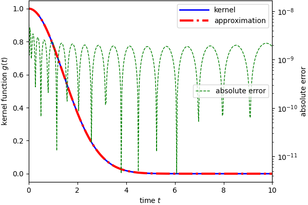

# VPMR C++ Implementation

[](https://doi.org/10.5281/zenodo.7770193)
[](https://codecov.io/gh/TLCFEM/vpmr)
[](https://pypi.org/project/pyvpmr/)
[](https://hub.docker.com/r/tlcfem/vpmr/tags)

[](https://www.gnu.org/licenses/gpl-3.0.en.html)

## Call For Help

- [ ] **more performant parallel SVD algorithm**: `eigen` only provides sequential SVD
- [ ] **alternative integration**: currently only Gauss-Legendre quadrature is available

## What Is This?

This is a C++ implementation of the VPMR algorithm to compute the approximation of arbitrary smooth kernel.
A Python package is also provided.

Check the reference paper [10.1007/s10915-022-01999-1](https://doi.org/10.1007/s10915-022-01999-1) and
the [original](https://github.com/ZXGao97/VPMR) MATLAB implementation for more details.

In short, the algorithm tries to find a summation of exponentials to approximate a given kernel function.
In mathematical terms, it looks for a set of $m_j$ and $s_j$ such that

$$
\max_{t\in{}I}\left\|g(t)-\sum_jm_j\exp(-s_jt)\right\|<\epsilon.
$$

In the above, $g(t)$ is the given kernel function and $\epsilon$ is the prescribed tolerance.

## Dependency

The following libraries are required:

1. [gmp](https://gmplib.org/) for multiple precision arithmetic
2. [mpfr](https://www.mpfr.org/) for multiple-precision floating-point computations
3. [tbb](https://github.com/oneapi-src/oneTBB) for parallel computing

The following libraries are included:

1. [mpreal](http://www.holoborodko.com/pavel/mpfr/) `mpreal` type C++ wrapper, included
2. [BigInt](https://github.com/faheel/BigInt) `BigInt` arbitrary large integer for combinatorial number, included
3. [Eigen](https://eigen.tuxfamily.org/) for matrix decomposition, included
4. [exprtk](https://github.com/ArashPartow/exprtk.git) for expression parsing, included
5. [exprtk-custom-types](https://github.com/ArashPartow/exprtk-custom-types.git) for `mpreal` support, included

## How To

### Python Package

> [!WARNING]
> The Python module needs external libraries to be installed.

> [!WARNING]
> Windows users need to have a working [MSYS2](https://www.msys2.org/) environment. See below for more details.
> For other environments, you need to figure out how to install `gmp` and `mpfr` on your own.

On RPM-based Linux distributions (using `dnf`), if you are:

1. compiling the application from source (or wheels are not
   available), `sudo dnf install -y gcc-c++ tbb-devel mpfr-devel gmp-devel`
2. using the packaged binary (wheels are available), `sudo dnf install -y gmp mpfr tbb`

On DEB-based Linux distributions (using `apt`), you need to `sudo apt install -y libtbb-dev libmpfr-dev libgmp-dev`.

On macOS, you need to `brew install tbb mpfr gmp`.

Then install the package with `pip`.

```
pip install pyvpmr
```

If the corresponding wheel is not available, the package will be compiled, which takes a few minutes.
The execution of the algorithm always requires available `gmp`, `mpfr` and `tbb` libraries.

#### Jumpstart

```python
import numpy as np

from pyvpmr import vpmr, plot


def kernel(x):
    return np.exp(-x ** 2 / 4)


if __name__ == '__main__':
    m, s = vpmr(n=50, k='exp(-t^2/4)')
    plot(m, s, kernel)
```

### Compile Binary

> [!WARNING]
> The application relies on `eigen` and `exprtk`, which depend on very heavy usage of templates.
> The compilation would take minutes and around 2 GB memory.
> You need to install libraries `gmp`, `mpfr` and `tbb` before compiling.

#### Docker

To avoid the hassle of installing dependencies, you can use the provided `Dockerfile`.
For example,

```bash
wget -q https://raw.githubusercontent.com/TLCFEM/vpmr/master/Dockerfile
docker build -t vpmr -f Dockerfile .
```

Or you simply pull using the following command.

```bash
docker pull tlcfem/vpmr
# or using GitHub Container Registry
docker pull ghcr.io/tlcfem/vmpr
```

#### Windows

Use the following instructions based on [MSYS2](https://www.msys2.org/), or follow the Linux instructions below with
WSL.

```bash
# install necessary packages
pacman -S git mingw-w64-x86_64-cmake mingw-w64-x86_64-tbb mingw-w64-x86_64-gcc mingw-w64-x86_64-ninja mingw-w64-x86_64-gmp mingw-w64-x86_64-mpfr
# clone the repository
git clone --depth 1 https://github.com/TLCFEM/vpmr.git
# initialise submodules
cd vpmr
git submodule update --init --recursive
# apply patch to enable parallel evaluation of some loops in SVD
cd eigen && git apply --ignore-space-change --ignore-whitespace ../patch_size.patch && cd ..
# configure and compile
cmake -G Ninja -DCMAKE_BUILD_TYPE=Release .
ninja
```

#### Linux

The following is based on Fedora.

```bash
sudo dnf install gcc g++ gfortran cmake git -y
sudo dnf install tbb-devel mpfr-devel gmp-devel -y
git clone --depth 1 https://github.com/TLCFEM/vpmr.git
cd vpmr
git submodule update --init --recursive
cd eigen && git apply --ignore-space-change --ignore-whitespace ../patch_size.patch && cd ..
cmake -DCMAKE_BUILD_TYPE=Release .
make
```

### Usage

All available options are:

```text
Usage: vpmr [options]

Options:

    -n, --max-terms             <int>     number of terms (default: 10)
    -c, --max-exponent          <int>     maximum exponent (default: 4)
    -d, --precision-bits        <int>     number of precision bits (default: 512)
    -q, --quadrature-order      <int>     quadrature order (default: 500)
    -m, --precision-multiplier  <float>   precision multiplier (default: 1.5)
    -e, --tolerance             <float>   tolerance (default: 1E-8)
    -k, --kernel                <string>  file name of kernel function (default uses: exp(-t^2/4))
    -s, --singular-values                 print singular values
    -w, --weights                         print weights
    -h, --help                            print this help message
```

The minimum required precision can be estimated by the parameter $n$.
The algorithm involves the computation of $C(4n,k)$ and $2^{4n}$.
The number of precision bits shall be at least $4n+\log_2C(4n,2n)$.
In the implementation, this number will be further multiplied by the parameter $m$.

#### Example

The default kernel is `exp(-t^2/4)`. One can run the application with the following command:

```bash
./vpmr -n 30
```

The output is:

```text
Using the following parameters:
       terms = 30.
    exponent = 4.
   precision = 355.
 quad. order = 500.
  multiplier = 1.5000e+00.
   tolerance = 1.0000e-08.
      kernel = exp(-t*t/4).

[1/6] Computing weights... [60/60]
[2/6] Solving Lyapunov equation...
[3/6] Solving SVD...
[4/6] Transforming (P=+9)...
[5/6] Solving eigen decomposition...
[6/6] Done.

M = 
+1.1745193571738943e+01+6.4089561283054790e-107j
-5.5143304351134397e+00+5.7204056791636839e+00j
-5.5143304351134397e+00-5.7204056791636839e+00j
-1.6161617424833762e-02+2.3459542440459513e+00j
-1.6161617424833762e-02-2.3459542440459513e+00j
+1.6338578576177487e-01+1.9308431539218418e-01j
+1.6338578576177487e-01-1.9308431539218418e-01j
-5.4905134221689715e-03+2.2104939243740062e-03j
-5.4905134221689715e-03-2.2104939243740062e-03j
S = 
+1.8757961592204051e+00-0.0000000000000000e+00j
+1.8700580506914817e+00+6.2013413918954552e-01j
+1.8700580506914817e+00-6.2013413918954552e-01j
+1.8521958553280000e+00-1.2601975249082220e+00j
+1.8521958553280000e+00+1.2601975249082220e+00j
+1.8197653300065935e+00+1.9494562062795735e+00j
+1.8197653300065935e+00-1.9494562062795735e+00j
+1.7655956664692953e+00-2.7555720406099038e+00j
+1.7655956664692953e+00+2.7555720406099038e+00j

Running time: 3112 ms.
```



#### Arbitrary Kernel

For arbitrary kernel, it is necessary to provide the kernel function in a text file.
The file should contain the kernel expressed as a function of variable `t`.

The `exprtk` is used to parse the expression and compute the value.
The provided kernel function must be valid and supported by `exprtk`.

For example, to compute the approximation of `exp(-t^2/10)`, one can create a file `kernel.txt` with the following
content:

```text
exp(-t*t/10)
```

In the following, the kernel function is echoed to a file and then used as an input to the application.

```bash
echo "exp(-t*t/10)" > kernel.txt
 ./vpmr -n 60 -k kernel.txt -e 1e-12
```


## Binary

The binary requires available `gmp`, `mpfr` and `tbb` libraries.

```bash
❯ ldd vpmr
     linux-vdso.so.1 (0x00007ffcf3121000)
     libgmp.so.10 => /lib64/libgmp.so.10 (0x00007f72087e8000)
     libmpfr.so.6 => /lib64/libmpfr.so.6 (0x00007f7208736000)
     libtbb.so.2 => /lib64/libtbb.so.2 (0x00007f72086f2000)
     libstdc++.so.6 => /lib64/libstdc++.so.6 (0x00007f7208400000)
     libm.so.6 => /lib64/libm.so.6 (0x00007f7208320000)
     libgcc_s.so.1 => /lib64/libgcc_s.so.1 (0x00007f72086d0000)
     libc.so.6 => /lib64/libc.so.6 (0x00007f7208143000)
     /lib64/ld-linux-x86-64.so.2 (0x00007f72088a1000)
```

The distributed `appimage` is portable.
